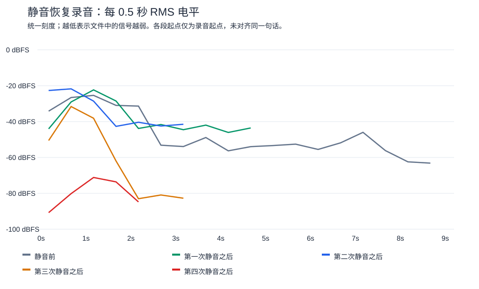

# 五次静音前后录音分析（2026-09-19）

结论：第三次恢复录音较第二次明显降低，第四次恢复后信号极弱；数据不支持每次切换后均单调降低。不能仅凭这些录音指定AGC、AEC或机械冲击为根因。

用户确认语音备忘录及聊天均使用VoiceKey。录音标签来自用户；没有同步HID/AGC日志，不能把后续设备读数反推到录音时刻。

| 录音 | 时长（秒） | 全段RMS dBFS | 峰值 dBFS | 100ms窗口RMS第90百分位 |
|---|---:|---:|---:|---:|
| 静音前 | 9.00 | -34.05 | -13.62 | -29.50 |
| 第一次静音之后 | 4.63 | -30.23 | -13.61 | -24.61 |
| 第二次静音之后 | 3.28 | -26.79 | -9.34 | -22.37 |
| 第三次静音之后 | 3.43 | -39.05 | -18.65 | -47.93 |
| 第四次静音之后 | 2.58 | -75.85 | -58.91 | -70.82 |

第四次相对静音前，全段RMS低41.80dB（幅度约为1/123）；相对第二次低49.06dB（幅度约为1/284）。这不是纯粹回放音量问题，文件本身幅度已经降低。但语料长度、停顿及说话响度会影响全段RMS，差值不等于设备受控增益损失。第90百分位窗口仍明显降低，说明不能只用第四段停顿较多来解释全段统计差异。

第三次录音前半段仍有较强信号，2秒之后半秒窗口约-81至-83dBFS；第四次全段峰值也只有-58.91dBFS。未进行可靠语音分段/听辨，因此不将前半段峰值直接称为人声，也不将后半段直接称为正常说话被压低。

方法：macOS afconvert解码为32-bit有符号PCM WAV；不增强、不归一化、不改变采样率。五段均48kHz单声道；全段及0.5秒窗口计算sqrt(mean(x²))，以2³¹为满幅参考；100ms完整窗口计算电平分位数。所有录音均无绝对幅度≥0.999的样本；这只证明解码文件无接近数字满幅的样本，不排除上游限幅。没有已知纯噪声段，不能可靠估算信噪比。AAC有损输出不能证明原始I2S有效位、USB静音零样本或输入时钟。

统计与原文件SHA-256：[JSON](logs/2026-09-19-five-mute-recordings.json)。原始录音不加入Git。

下一步：部署只读AGC诊断候选后，同一次连续录音中保留静音前及至少四轮恢复后的相同短句，同步记录AGC/静音/采集故障；设备固定并尽量轻按。再做不切换Mute的轻触对照。未获得对应证据前，不盲目提高固定增益或恢复此前失败的AGC门限参数。
